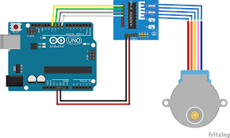

# examenElectronicaUniacc
Titulo de mi proyecto final

## Descripcion conceptual del proyecto

Lorem ipsum dolor sit amet, consectetur adipiscing elit. Maecenas volutpat neque euismod sodales laoreet. Ut quis dapibus erat, in faucibus lorem. Etiam bibendum, erat sed lobortis pulvinar, mi turpis dictum nisl, finibus pulvinar lacus sapien vel ex. Phasellus porttitor suscipit lacus nec rhoncus. Pellentesque mollis dui a ex posuere rutrum. Nunc ac sodales metus. Fusce id sollicitudin magna. Praesent viverra nunc at condimentum semper. Praesent ac venenatis tortor, et viverra tortor. Donec at ipsum elit. Pellentesque habitant morbi tristique senectus et netus et malesuada fames ac turpis egestas. Curabitur pretium, nisi a posuere iaculis, odio orci fermentum ipsum, ut sodales lorem augue et arcu.

Etiam maximus eros at orci consectetur, eget semper ex pulvinar. Duis commodo hendrerit risus in tempus. Phasellus enim tortor, efficitur vel nunc quis, rhoncus vulputate lacus. Nulla facilisi. Aliquam at nisl felis. Suspendisse gravida enim purus, sit amet fringilla nisl placerat vitae. Etiam eget justo maximus, fermentum eros sed, luctus nibh. Sed cursus, tellus at porta porttitor, ligula neque posuere sapien, eget porta ex risus eget mi. In auctor suscipit commodo. Quisque eu nibh a dui fermentum ornare eget id metus.

## Descripción técnica del proyecto

(siempre es bueno colocar lineas con enter entre las secciones)

Nulla volutpat, est at mattis facilisis, massa felis dignissim metus, ut luctus nisi nulla lacinia nunc. Sed a congue diam. Donec egestas consequat consectetur. Nulla ultricies sapien a tristique congue. Orci varius natoque penatibus et magnis dis parturient montes, nascetur ridiculus mus. In sed mi id sapien placerat tincidunt. In nec euismod erat, eget auctor risus. Vestibulum rhoncus orci tellus, vel condimentum lectus imperdiet sed. Vestibulum ante ipsum primis in faucibus orci luctus et ultrices posuere cubilia curae; Etiam quis urna est. Mauris varius commodo turpis, nec convallis nibh dignissim sit amet. Nulla in urna non felis aliquet egestas. Curabitur quis libero sit amet massa fringilla fringilla. Duis ornare orci ipsum, et volutpat erat finibus id.

Fusce iaculis ligula a tortor euismod, ut tincidunt dolor porttitor. Aliquam ipsum mauris, pellentesque eu semper vitae, sodales at tellus. Mauris a turpis quis justo feugiat luctus convallis vitae mauris. Sed sed felis non erat eleifend ultricies ac ac lacus. Donec eleifend vitae leo quis posuere. Phasellus nec lacinia urna, quis egestas justo. Mauris imperdiet ligula id ante mollis, nec gravida enim malesuada. Interdum et malesuada fames ac ante ipsum primis in faucibus. Integer convallis nibh sit amet urna imperdiet luctus. Mauris pellentesque vehicula accumsan. Nulla pulvinar, dui nec facilisis rutrum, ipsum ex porta sapien, id aliquam erat massa dapibus nisi. Quisque a ultricies mauris.

### Para agregar imagenes en el README

Para agregar imágenes utilizo la estructura \!\[texto alternativo que se ve si no carga la imagen](./nombrearchivo)

``

### Para agregar un pedazo de código

Deben meter el código entre tres virgulillas ` ~~~ aqui su codigo ~~~ `

~~~
//CONEXIONES arduino -> Driver
// ARD 2 - IN 1
// ARD 3 - IN 2
// ARD 4 - IN 3
// ARD 5 - IN 4
//SALIDAS DEL ARDUINO AL PASO A PASO
int out1 = 2;
int out2 = 3;
int out3 = 4;
int out4 = 5;
~~~
_______________

Tutorial para trabajar con markdown [aquí](https://markdown.es/sintaxis-markdown/)
